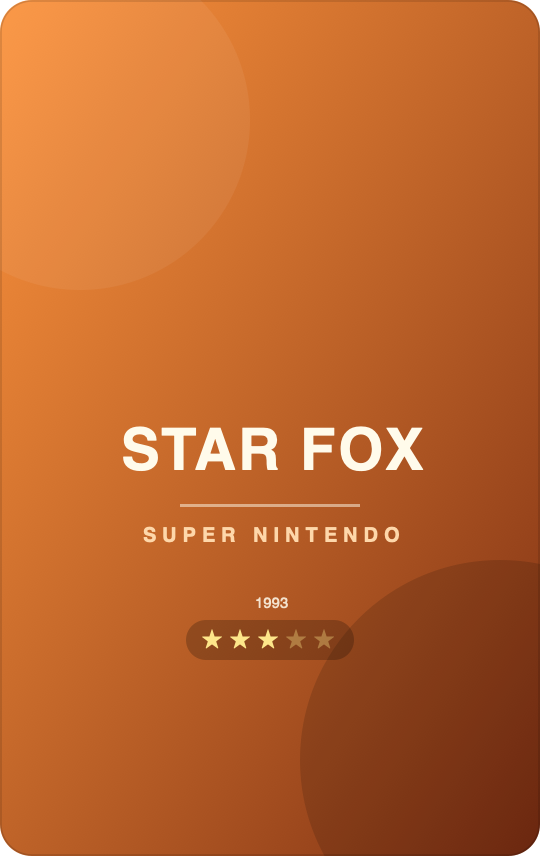

# Zap-Studio

Browser app for designing credit-card-sized stickers (ISO ID-1, portrait
54 × 85.6 mm) for consoles. Runs entirely locally – no server, no login.

<p align="center">
  
  
</p>

UI built with **shadcn/ui** (Radix + Tailwind CSS v4, "new-york" style,
dark theme). UI primitives live in `src/components/ui/`; `components.json`
enables `npx shadcn@latest add <component>`.

## Features

- **Console/game tree** (left): 5 classic consoles (PlayStation,
  Nintendo 64, Super Nintendo, NES, Neo Geo) each with their top 5 games
  ([src/data/catalog.ts](src/data/catalog.ts)). Selecting a game creates
  a sticker design for it (with a title text layer) or opens the
  existing one – the game→design mapping lives in `localStorage`.
  The game count is shown in parentheses under "All consoles" and each
  console.
  - **Right-click a console** → "Add" or "Rename" (self-added consoles
    also get "Remove"). **Right-click a game** → "Rename" or "Remove"
    (an already-created design stays under "Projects"). Renaming only
    changes the label – the internal id (and with it `gameKey`, the
    template and `gamelist.xml`) stays the same; a linked design and its
    metadata entry (matched by title, renamed along with it) are kept.
    These changes are stored as a diff (added/removed/renamed consoles &
    games) in `localStorage` (`stickerstudio:catalogOverlay`) and are
    part of the ZIP backup.
  - **Base set** (toolbar): pulls consoles/games from the bundled
    [`base_game_list.csv`](src/data/base_game_list.csv) (top-N per
    console, 27 systems). A dialog with a selectable tree; "Continue"
    creates the checked entries in the tree **including metadata** (year,
    publisher, players, genre, rating → the respective `gamelist.xml`).
    Consoles that don't exist yet are created as their own console;
    NES/SNES/… and same-named ones land in the matching existing console.
  - **Filter** (funnel icon next to "All consoles"): all games, only
    games **with** an image, or only **without** one (= design has an
    image layer). While a filter is active the parenthesised count shows
    `visible/total`; the choice is saved to `localStorage`. The
    currently open design counts live.
- **Template hierarchy** (in the tree, top to bottom):
  - **Global template** ("All consoles") – layers on **every** card,
    regardless of console. Project `tpl-global`. Its own background is
    always on, and **guides are only created/edited here** (see below).
  - **Console template** (click a console name) – layers on every game
    card of that console. Project `tpl-<console>`.
  - **Game design** – the card itself.

  Render order on a card (bottom → top): card background → game layers
  → console template → global template. Template layers are read-only
  on a game card and are included in the PNG export. Editing a console
  template shows the global template as context. Templates don't appear
  in the project list.
- **Background** is its own, bottommost **layer** (paint-bucket icon, not
  draggable). By default a design has **no** background – "+ →
  Background" adds one; it can be shown/hidden, edited and removed again.
  Fill: solid **or** gradient (two colours + angle) plus an optional
  grain/noise overlay (0–100 %). Carried over into the PNG export.
  - In the background layer's properties, a **game card** picks the
    **background source**: its own background, "From the console
    template" or "From the global template" (the latter two disabled as
    long as the template has no background layer). Migrated legacy
    designs keep "From the global template".
- **Shapes**: "+ Shape" → capsule, square/rectangle, circle. Every shape
  has the same fill as the card (solid **or** gradient) plus an optional
  noise overlay, plus stroke/stroke width and, for the rectangle, a
  corner radius.
- **Alpha mask**: any layer (shape, image or text) can be flagged as a
  **mask** in the Inspector – its alpha channel clips the layer(s)
  directly beneath it ("Into mask"). This lets you, say, place a circle
  on top and load an image underneath "into the circle". The covered
  layer stays freely movable; the mask itself is picked from the layer
  list.
  - **Several layers per mask**: in the mask's Inspector, "Add layer" /
    "Release top", or "Into mask" on individual layers.
  - **Move layers together** (checkbox on the mask, optional): moving,
    scaling and rotating the mask then affects every layer in the mask.
  - "Dissolve mask" frees the mask + all its children again.

  Implemented via `globalCompositeOperation: "destination-in"` per mask
  group in its own Konva layer – carries over 1:1 into the PNG export.
- **Main image + main alpha mask**: every game card has a *main image*
  (image layer, "Main image" checkbox in the Inspector; "Find cover" and
  "Quick Import" set it automatically, otherwise the card's only image
  counts). On **"All consoles"** you set up **one** *main alpha mask*
  ("+ Shape → Main alpha mask", or the checkbox on a shape/image). Its
  alpha channel automatically clips the main image on **every** card –
  so the frame is only designed once. The mask shape itself isn't drawn
  on the cards. **A freshly inserted main image is automatically scaled
  to fully cover the mask** (both height and width, aspect ratio kept,
  overflow cropped) and centred on the mask.
- **Layers**: images, shapes, any number of text layers. Select, move,
  scale, rotate, lock, hide, duplicate. Reorder via **drag & drop** in
  the layer list (grip handle on the left, a drop line shows the target
  position).
- **Images**: "+ Image" → upload a file or paste from a URL (PNG/JPG/SVG/
  WebP …). URL images are downloaded and embedded into the project – the
  host must allow cross-origin access, otherwise you get a notice. Large
  images are downscaled to max. 2400 px.
- **Find cover**: with a game card open, the "Find cover" button
  (toolbar) searches for box art by console + game title. A dialog shows
  the results as previews; clicking one downloads the image, embeds it
  and sets it as the main image layer (same path as "paste from URL").
  The source is switched at the top of the dialog; credentials live in
  `localStorage`.
  - On **"All consoles"** the same button steps **through every card
    with no image, one after another**: per card, the search dialog with
    a "Cover 3 / 25" counter; a click inserts the cover into that design
    (creating it if needed) and jumps to the next card; "Skip" leaves a
    card out.
  - **SteamGridDB**: API key (free at
    [steamgriddb.com](https://www.steamgriddb.com/profile/preferences/api)).
    Every console, high-resolution box art, many variants.
  - **IGDB**: Twitch client ID + secret (free at
    [dev.twitch.tv](https://dev.twitch.tv/console/apps)). Official cover
    + artworks per game.
  - **Without credentials**: falls back to
    [libretro-thumbnails](https://github.com/libretro-thumbnails) (static
    scans on GitHub, no key) – retro/emulation consoles only (NES/SNES/
    N64, Mega Drive/Genesis, PlayStation 1–4, GameCube/Wii …).

  SteamGridDB's API/CDN and IGDB's API block browser CORS (IGDB also
  needs a Twitch OAuth token). These calls are forwarded through Vite's
  own dev/preview server (`server.proxy` + the `coverImageProxy`
  middleware in `vite.config.ts`), so an API key only ever travels
  browser → local Vite → the upstream service, never through a
  third-party proxy. The packaged desktop app uses the Electron-side
  equivalent instead (see "Desktop app" below). IGDB's image CDN and
  libretro-thumbnails already send CORS headers, so those load directly.
  See [src/covers.ts](src/covers.ts).
- **Quick Import** (toolbar): bulk import for images. Opens a table of
  every game whose design has no image layer yet (columns console / game
  / URL). Enter one image URL each, "Done" – each URL is fetched,
  embedded and placed as an image layer in the respective design
  (creating it if it doesn't exist yet). Failed URLs (CORS, 404, not an
  image) stay listed with an error and can be retried. See
  [src/quickImport.ts](src/quickImport.ts).
- **Fonts**: system fonts + Google Fonts (Oswald, Bebas Neue, Montserrat,
  Press Start 2P, Rubik Mono One) + your own uploaded font files
  (.ttf/.otf/.woff/.woff2, per workspace, see
  [src/customFonts.ts](src/customFonts.ts)). Colour, stroke, alignment,
  line height, letter spacing.
- **Guides**: trim edge (3 mm), final size, safe zone (3 mm). **Off** by
  default – the preview shows the plain card, cropped to the final size
  with rounded corners.
- **Custom guides**: vertical/horizontal lines that appear on **every**
  card. Created and edited **only on "All consoles"** (toolbar ruler menu
  + the "Guides" panel in the Inspector, "Guides" checkbox on/off). Drag
  on the card to position, drag past the edge or use the trash icon in
  the Inspector to delete, mm-precise entry in the Inspector. On game
  cards and console templates they're only shown (not draggable). Stored
  globally in `localStorage`, not part of the PNG export.
- **Demo mode** (toolbar button "Demo"): booster-pack simulation. First
  pick a console or "All consoles", then a sealed pack with 12 random
  cards sits there. A click tears it open – the cards fly out with a 3D
  animation and land in a grid. With a **10 % chance** one of them is
  **holographic** (gold frame + foil shimmer). Any card can be clicked and
  freely rotated in the same 3D view as the preview; ← → or the arrow
  buttons page through the pack. Cards are rendered with the same Konva
  pipeline as the editor (including templates, masks and the main alpha
  mask); games with no design get a title placeholder card. See
  [src/demo.ts](src/demo.ts) and
  [src/components/DemoMode.tsx](src/components/DemoMode.tsx).
- **3D preview**: a toolbar button opens the card as a 3D object (CSS
  perspective), freely rotatable with the mouse. The "Holographic card"
  checkbox overlays a rainbow foil/glitter/gloss effect that shifts with
  rotation. Uses the final-size export (no guides).
- **Export**:
  - PNG, final size (54 × 85.6 mm, 300 DPI ≈ 638 × 1011 px)
  - PNG with 3 mm bleed
  - PNG with bleed + crop marks
  - **PDF for a card-tray printer** (e.g. Canon's): one page per face,
    each sized exactly to the trim – no bleed, no crop marks. Meant to be
    printed straight onto a blank card via the printer's own tray at
    "actual size / 100 %". Card format only. See
    [src/pdf.ts](src/pdf.ts) (`cardTrayPdf`).
  - Save/load a single project as `.json` (images embedded)
  - **Full backup as `.zip`**: every project, template (global +
    console), the guides, the game index and the tree changes
    (added/removed games); images as real, deduplicated files under
    `assets/`. Loading restores everything (same ids get overwritten)
    and reloads the page.
- **Autosave** in IndexedDB, multiple designs via the "Projects" dialog.
- **Shortcuts**: ⌘Z / ⌘⇧Z (undo/redo), Delete (delete layer), Esc (clear
  selection).
- **gamelist.xml / metadata**: an uploadable `gamelist.xml` per console
  (EmulationStation format: `<name>`, `<desc>`, `<image>`,
  `<releasedate>`, `<developer>`, `<publisher>`, `<genre>`, `<players>`,
  `<rating>`) – in the console template panel under "Properties" (click
  the console name in the tree). Only with a game card open does the
  right-hand sidebar have a **"Metadata" tab** (templates don't): it
  shows the entry matched by title from the loaded `gamelist.xml` as an
  **editable form** – click the star rating (left/right half of a star
  for half steps, 0.5 precision), edit image URL/path, description,
  release date, developer, publisher, genre and player count directly;
  every change is written straight back into that game's `gamelist.xml`.
  If there's no entry yet, the form starts empty and creates one
  automatically the first time you fill it in; a trash button removes it
  again. Example files for all 5 consoles live under `public/gamelists/`
  and can be loaded straight from the panel via "Load example". Purely
  local, in `localStorage`, not part of the PNG export.
  - **Metadata layers** (in the "+ Shape" menu, "From gamelist.xml"
    section): special, configurable layers placed on a console/global
    template that read live from the currently open game's
    `gamelist.xml` – the right values automatically per card, with
    nothing to maintain per game. Addable individually for **rating**
    (★, out of 5), **release year** or **player count** (each freely
    positionable and scalable), or as "All combined" in one layer. The
    **player icon is configurable** (automatically single/multiplayer
    based on player count, or fixed to single-player / multiplayer /
    controller), plus text/star colour and an optional background chip.
    While editing a console template, the layers preview data from the
    first loaded gamelist entry; without matching data, "–" placeholders
    show instead of made-up values. Renders entirely from Konva
    primitives (no image icon), so it carries over unchanged into the
    PNG export.

- **Language**: switcher top right (globe icon) between **English**
  (default) and **German**. The choice lives in `localStorage`
  (`stickerstudio:lang`); all text comes from [src/i18n.ts](src/i18n.ts)
  with the translation table [src/locale/de.ts](src/locale/de.ts) (the
  English strings in the code are the keys).

- **Front & back**: "＋ Back side" adds a second face to the card; a
  **Front | Back** switch then toggles between them. Each side has its
  own layers and background; the back also appears in the 3D preview and
  the export (`_front` / `_back`).

- **Format**: a global switcher top right (shape icon) between **credit
  card**, **cassette label**, **floppy disk label**, **DVD wrap** and
  **cassette case (J-card)**. Defined in [src/formats.ts](src/formats.ts)
  (dimensions adjustable there); the choice lives in `localStorage`
  (`stickerstudio:format`), switching reloads the page. Each format has
  its own designs, its own templates ("All consoles" / console
  templates, id suffix `--<format>`) and its own game index.
  **Multi-panel formats** (DVD wrap = flap + spine + book-spine + front +
  flap, J-card = front + book-spine + back + insert flap) are one
  continuous artboard with fold lines (`panels` in `formats.ts`); the
  folds show up as guides in the editor, as fold marks in the "crop
  marks" export, and in a flat 3D preview.

## Development

```bash
npm install
npm run dev      # http://localhost:5173
npm run build    # production build into dist/
```

Stack: Vite + React 19 + TypeScript, Tailwind CSS v4 (`@tailwindcss/vite`),
shadcn/ui, `react-konva`/`konva` for the canvas, `idb-keyval` for
IndexedDB storage. Path alias `@/` → `src/`.

## Desktop app (Electron)

The same app, packaged as a standalone program for macOS/Windows/Linux –
no dev server needed, with its own IndexedDB/localStorage in the user
profile.

```bash
npm run dev:electron   # development: Vite dev server + Electron window
npm run dist           # build + installers into release/ (dmg/zip, nsis, AppImage/deb)
```

Two things can only be done by a real Node process with no CORS
restriction – the browser version has the Vite proxies from
`vite.config.ts` for that; the desktop app has an Electron-main-process
equivalent:

| Purpose | Browser (Vite dev server) | Desktop (Electron) |
| --- | --- | --- |
| SteamGridDB/IGDB/Twitch API | `server.proxy` in `vite.config.ts` | IPC `desktop:apiFetch` in `electron/main.ts` |
| Load a cover image (CORS) | `/img?url=…` middleware | Custom scheme `app-img://` in `electron/main.ts` |
| Zaparoo Core connection | `/zaparoo?ip=…` middleware (Node WebSocket) | IPC `desktop:zaparooRpc` (Node WebSocket via `ws`) |

`src/desktop.ts` detects whether `window.desktop` exists (set by the
preload script `electron/preload.ts`) and switches `src/covers.ts` /
`src/zaparoo.ts` accordingly – the same app code runs unchanged in both
environments.

`npm run build:electron` compiles `electron/*.ts` into `dist-electron/`
(its own `tsconfig.electron.json`, CommonJS). electron-builder
configuration lives in the `"build"` key of `package.json`. For real
Windows/Linux installers, CI (one runner per OS) is the better bet than
cross-building from macOS – see `.github/workflows/build-desktop.yml`.

## Structure

| File | Purpose |
| --- | --- |
| `src/formats.ts` | Sticker formats (dimensions, bleed, radius) + active choice |
| `src/card.ts` | Active format's dimensions, DPI, derived pixel values |
| `src/background.ts` | Normalise background, gradient points, noise tile |
| `src/masking.ts` | Split the layer stack into plain/mask segments |
| `src/data/catalog.ts` | Seed consoles + local overlay (add/rename/remove consoles & games) |
| `src/components/GameTree.tsx` | Left-hand tree view (incl. right-click menu) |
| `src/components/ContextMenu.tsx` | Minimal right-click menu (no extra dependency) |
| `src/gameIndex.ts` | Game → project id mapping (localStorage) |
| `src/types.ts` | Data model (Layer, Project) |
| `src/i18n.ts` | Language switching (EN/DE), the `t()` function + `useT()` hook |
| `src/locale/de.ts` | German translation table (keys = the English source text) |
| `src/store.tsx` | Reducer, undo/redo, autosave, shortcuts |
| `src/components/EditorCanvas.tsx` | Konva stage, transformer, guides |
| `src/components/Toolbar.tsx` | Add layer, export, projects |
| `src/components/Inspector.tsx` | Properties of the selected layer |
| `src/export.ts` | PNG rendering with bleed & crop marks |
| `src/pdf.ts` | Hand-rolled PDF writer: the print/cut-sheet PDF and the card-tray PDF |
| `src/persist.ts` | IndexedDB storage (`idb-keyval`) |
| `src/backup.ts` | Full backup as ZIP (`fflate`), images as files |
| `src/gamelist.ts` | Parse/save gamelist.xml, match metadata by title, live-update subscription |
| `src/components/MetadataPanel.tsx` | Sidebar "Metadata" tab (editable form) |
| `src/covers.ts` | Cover search: SteamGridDB / IGDB (keys, via CORS proxy) or libretro-thumbnails |
| `src/data/baseGameList.ts` | Parses `base_game_list.csv` (consoles/games + metadata) |
| `src/components/BaseImportDialog.tsx` | "Base set": selectable tree + import including metadata |
| `src/quickImport.ts` | Bulk import: find games with no image, load URLs as a layer |
| `src/components/CoverSearchDialog.tsx` | Picker dialog for found covers (with sweep mode) |
| `src/components/CoverSweepDialog.tsx` | "All consoles": every image-less card, one after another |
| `src/demo.ts` | Demo mode: draw a booster pack (random cards, holo chance) |
| `src/components/DemoMode.tsx` | Pack-opening animation, card grid, 3D single view |
| `src/components/CardStage.tsx` | Render a card read-only & grab it as a PNG |
| `public/gamelists/*.xml` | Example gamelist.xml per console |
| `src/customFonts.ts` | Uploaded font files: add/remove/list, register as FontFace |
| `src/desktop.ts` | Bridge to Electron (`window.desktop`), falls back to the browser proxies |
| `electron/main.ts` | Electron main process: window, `app-img://` scheme, IPC proxies |
| `electron/preload.ts` | `contextBridge`: exposes `window.desktop` safely |

## Legal

Console and game logos, as well as cover art, are trademarked and/or
copyrighted – only upload your own or licensed artwork, and use the
result privately.

## License

[MIT](LICENSE)
